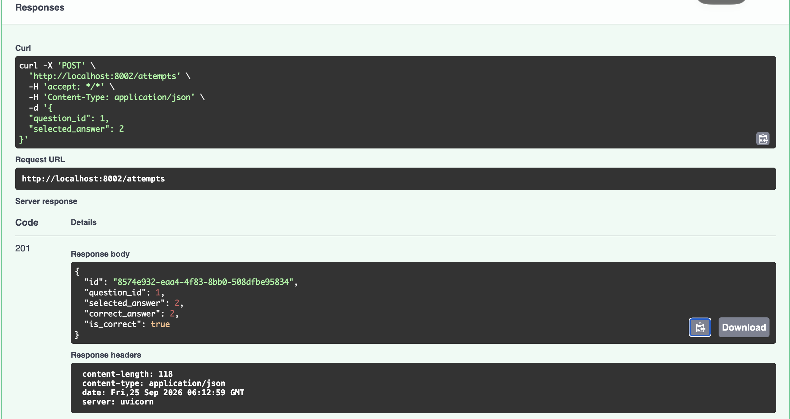

# AI Exam Coach Mini MSA

FastAPI와 Docker를 이용하여 구현한 간단한 MSA 기반 문제 풀이·채점 백엔드입니다.
## Architecture

사용자
↓
Attempt Service
↓ HTTP
Question Service

- Question Service: 문제와 정답 제공
- Attempt Service: 답안 제출, Question Service 호출, 채점 결과 반환
- 각 서비스는 독립적인 FastAPI 서버와 Docker 컨테이너로 실행됩니다.

## Tech Stack

- Python 3.12
- FastAPI
- Docker
- Docker Compose
- HTTPX

## Swagger

Docker Compose 실행 후 아래 주소에서 API를 테스트할 수 있습니다.

- Question Service: http://localhost:8001/docs
- Attempt Service: http://localhost:8002/docs

## Services

### Question Service

- `GET /health`
- `GET /questions`
- `GET /questions/{question_id}`

외부 포트: `8001`

### Attempt Service

- `GET /health`
- `POST /attempts`
- `GET /attempts/{attempt_id}`

외부 포트: `8002`

## Run

```bash
docker compose up -d --build
```

## Result

### MSA 서비스 간 통신 및 채점 성공

Attempt Service가 Question Service를 HTTP로 호출하여 정답을 확인하고, 채점 결과를 정상적으로 반환했습니다.


